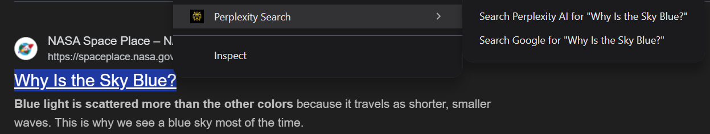

# Perplexity AI Chrome Extension

Replaces Google as the default search for the chrome omnibox (url box) and uses [perplexity.ai](https://www.perplexity.ai/) instead.
Can still use Google for search results if your search begins with "g" + space and then your search.

### Example Use

In the omnibox typing
`why is the sky blue` will direct to perplexity.ai and it will answer your question.
`g why is the sky blue` will direct to google.com and give you search results.

Also has a right click context menu to search via perplexity or Google.

## Instalation

Download the folder, go to [chrome://extensions/](chrome://extensions/) and at the top right of the screen toggle **Developer mode** on and then on the left side of the window click **Load unpacked**.
Upload the folder and you will be notified the extension is enabled.
